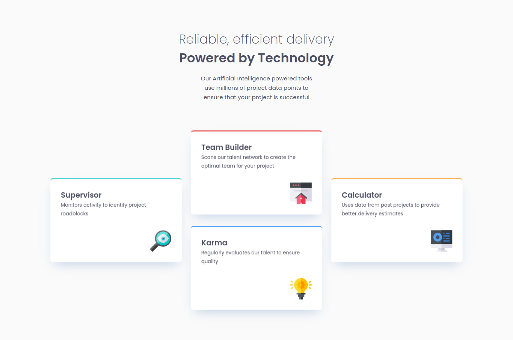

# Frontend Mentor - Four Card Feature Section

This is a solution to the [Four card feature section challenge on Frontend Mentor](https://www.frontendmentor.io/challenges/four-card-feature-section-weK1eFYK). Frontend Mentor challenges help you improve your coding skills by building realistic projects. 

## Table of contents

- [Overview](#overview)
  - [Screenshot](#screenshot)
  - [Links](#links)
- [My process](#my-process)
  - [Built with](#built-with)
  - [Useful resources](#useful-resources)
- [Author](#author)
- [Acknowledgments](#acknowledgments)

## Overview

### Screenshot

### Links

- Solution URL: [GitHub repository](https://github.com/welpmoz/Four-Card-Section-Challenge).
- Live Site URL: [Live site](https://welpmoz.github.io/Four-Card-Section-Challenge/)

## My process

### Built with

- Semantic HTML5 markup
- CSS custom properties
- CSS flexbox
- Class based CSS styles
- Google Fonts
- Git

### Useful resources

- [Google Fonts](https://fonts.google.com/): Provide beatiful fonts to integrate in your web sites.
- [CSS examples](https://github.com/lsvekis/HTML-CSS-Exercises-Book): Simple but powerful examples that improve my CSS skills.

## Author

- Github - [Roswell Jaime](https://github.com/welpmoz)
- Frontend Mentor - [@welpmoz](https://www.frontendmentor.io/profile/welpmoz)

## Acknowledgments

I greatly appreciate the work done by the Frontend Mentor team. Their challenges are diverse and well-suited for developers at all levels. Additionally, I'm grateful for the inclusion of Figma as a useful resource.